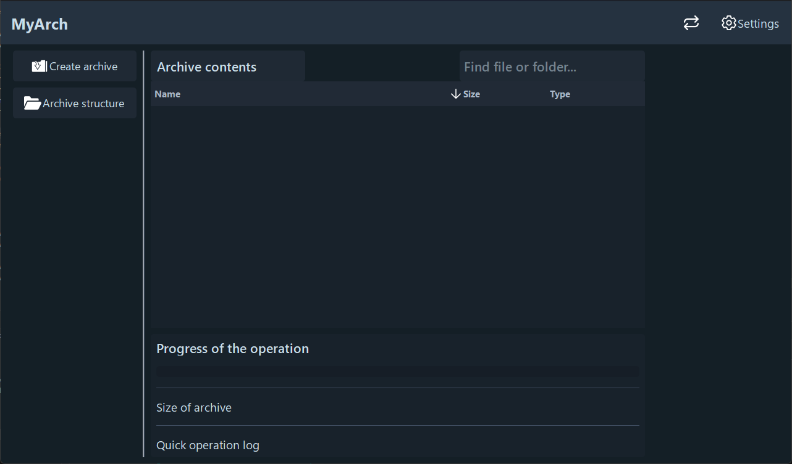
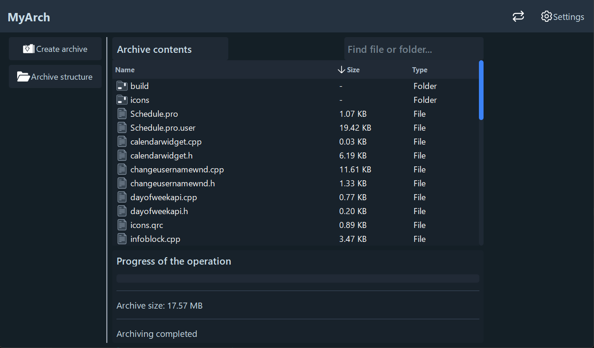

# MyArch (C++ / Qt)

**MyArch** is a simple and minimalist app that creates an archive from your folder or single file using the Qt framework for UI and zip for archive creation and core process.

## Features

- 📁 Clean folder structure and CMake build
- 🧪 Unit tests
- 🧩 Output all added folders and files for viewing
- 📊 Determining the full size of the archive
- 🎨 Change theme
- 🔎 Search for the required file in the archive
- 🌳 View file structure tree 

## 🖼️ Screenshots

## How to run the tests 🧪

1.Clone repository, open command console in downloaded repo  
2.Run these commands:
- cmake -S . -B build
- cmake --build build
- build\ArchiveTests.exe

## Project structure 📁:
### Archiver/
├── Resources // icons for app  
├── Core // main logic  
├── UI // user interface  
├── UnitTests // tests  
└── README.md // This file
